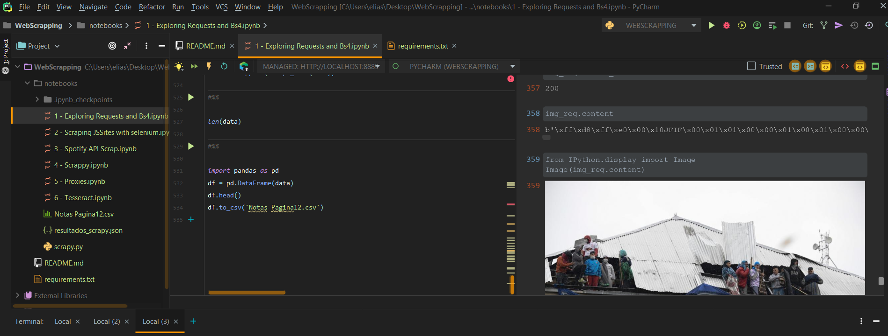

# Web Scraping en la web

Probando herramientas de Scraping como:

* Request y BS4
* Selenium (JS Sites)
* Scrapy
* API Spotify
* Tesseract (OCR)
* Proxies

# Herramientas de desarrollo usadas
* Pycharm
* Python 3
* Anaconda
* Jupyter Notebook

# Preview

  

